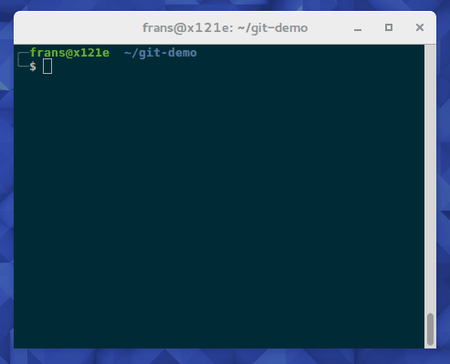
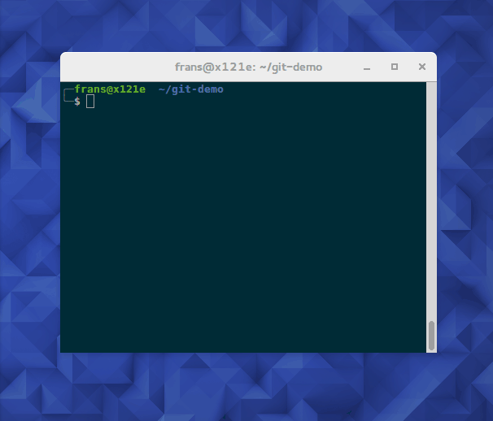

# screensnippet
record screencasts in gif using `byzanz` - make selecting the recorded area and running the command easy with screensnippet

Get & Install
-------------
    
    apt-get install byzanz
    # or
    dnf install byzanz

    git clone https://github.com/frans-fuerst/byzanz-gui.git
    ./byzanz-gui/byzanz-gui

